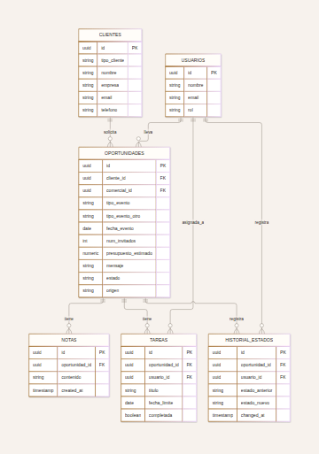

# La Mesa Perfecta — CRM en Next.js + Supabase

Proyecto de práctica: una web pública con formulario de contacto (`/`) y un
CRM interno con pipeline visual (`/crm`), construidos con **Next.js 14 (App
Router) + TypeScript + Tailwind CSS**, conectados a la misma base de datos
en **Supabase**. Cuando alguien rellena el formulario, aparece al instante
como nueva oportunidad en el CRM gracias a Supabase Realtime.

## Estructura del proyecto

```
app/
  page.tsx            → web pública (landing + formulario de contacto)
  crm/page.tsx         → CRM: barra fija, buscador, filtro por empleado, Kanban y estadísticas
  layout.tsx / globals.css
components/
  ContactForm.tsx      → formulario público (crea cliente + oportunidad)
  KanbanBoard.tsx       → tablero por estados con drag & drop
  LeadCard.tsx          → tarjeta de una oportunidad (empresa, empleado, importe)
  NewOpportunityModal.tsx → alta de oportunidad desde el CRM, con empresa y empleado
  OpportunityModal.tsx  → ficha lateral: asignación, estado, datos, tareas y notas
  AssignmentFields.tsx  → selectores de empresa y empleado (con alta rápida)
  StatsBar.tsx          → métricas del pipeline
  ui.tsx                → iconos, avatares, formateadores y estilos compartidos
lib/
  supabaseClient.ts     → cliente de Supabase (usa variables de entorno)
  types.ts              → tipos TypeScript del modelo de datos
supabase/
  schema.sql            → las 4 tablas del modelo entidad-relación
docs/
  er-diagram.png         → diagrama entidad-relación (imagen)
  er-diagram.mmd         → diagrama entidad-relación (fuente editable, formato Mermaid)
```

## Modelo de datos

El esquema (`supabase/schema.sql`) tiene 7 tablas:

**En uso activo por la interfaz:**
- `clientes` — particulares o empresas que piden presupuesto
- `oportunidades` — el pipeline de negocio (lo que ves en el Kanban), enlazada a un cliente, a una **empresa** (`empresa_id`) y a un **empleado** responsable (`comercial_id`)
- `empresas` — cuentas a las que se asocian las oportunidades (nombre, CIF, sector…)
- `usuarios` — empleados del equipo; se asignan como responsables de oportunidades y tareas
- `tareas` — seguimiento comercial por oportunidad
- `notas` — historial de interacciones (llamadas, emails, reuniones)

**Preparada para el futuro (sin pantalla propia todavía, pero ya en la base de datos):**
- `historial_estados` — se rellena sola mediante un trigger cada vez que una oportunidad cambia de estado. No hace falta tocar nada: cuando quieras mostrar una línea de tiempo o un embudo de conversión, los datos ya estarán ahí esperando.

Diagrama completo en `docs/er-diagram.png`:



## Puesta en marcha

### 1. Crear el proyecto en Supabase
1. Ve a [supabase.com](https://supabase.com) → **New project**.
2. Elige nombre, contraseña de base de datos y región.

### 2. Crear las tablas
1. **SQL Editor → New query**.
2. Pega todo el contenido de `supabase/schema.sql` y pulsa **Run**.

> **¿Ya tenías el proyecto creado?** No hace falta rehacerlo: ejecuta solo
> `supabase/migracion_empresas_empleados.sql` (SQL Editor → New query → Run).
> Crea la tabla `empresas` y añade `empresa_id` a `oportunidades`. Es seguro
> ejecutarla más de una vez.

### 3. Variables de entorno
1. En Supabase: **Project Settings → API** → copia el **Project URL** y la clave **anon public**.
2. Copia `.env.local.example` como `.env.local`:
   ```bash
   cp .env.local.example .env.local
   ```
3. Rellena los dos valores:
   ```
   NEXT_PUBLIC_SUPABASE_URL=https://TU-PROYECTO.supabase.co
   NEXT_PUBLIC_SUPABASE_PUBLISHABLE_KEY=TU_CLAVE_PUBLISHABLE_AQUI
   ```

### 4. Instalar y arrancar en local
```bash
npm install
npm run dev
```
- Web pública: [http://localhost:3000](http://localhost:3000)
- CRM: [http://localhost:3000/crm](http://localhost:3000/crm)

Rellena el formulario de la web pública y comprueba que la oportunidad
aparece sola en el tablero del CRM (sin recargar), gracias a la
suscripción en tiempo real.

### 5. Desplegarlo
La forma más sencilla es **Vercel** (mismo creador que Next.js):
1. Sube el proyecto a un repositorio de GitHub.
2. Impórtalo en [vercel.com](https://vercel.com/new).
3. Añade las mismas variables de entorno (`NEXT_PUBLIC_SUPABASE_URL`, `NEXT_PUBLIC_SUPABASE_PUBLISHABLE_KEY`) en la configuración del proyecto en Vercel.
4. Deploy. Vercel detecta Next.js automáticamente.

## Nota sobre seguridad (para la memoria del proyecto)

Las políticas RLS de `schema.sql` son deliberadamente abiertas (cualquiera
con la clave `anon` puede leer/escribir) para que el CRM funcione sin
necesidad de login. Es correcto para una práctica académica, pero en un
CRM real esto se resolvería con **Supabase Auth**: solo el formulario
público podría insertar clientes/oportunidades, y el CRM exigiría inicio
de sesión del equipo comercial con políticas restringidas a usuarios
autenticados. Buen punto para mencionar como "mejora futura" en la
memoria del curso.

## Posibles ampliaciones si el curso pide más nivel

- Login de empleados con Supabase Auth (ahora se asignan a mano desde el CRM).
- Pantallas propias de gestión de empresas y empleados (hoy se crean desde los selectores de la oportunidad).
- Mostrar `historial_estados` como una línea de tiempo en la ficha de la oportunidad, o como gráfica de embudo de conversión (los datos ya se registran solos).
- Catálogo de `servicios` y línea de presupuesto por evento.
- `proveedores` externos asignados a cada evento y registro de `pagos`.
- Más filtros en el tablero (por fecha, tipo de evento, rango de presupuesto). Ya hay buscador y filtro por empleado.
